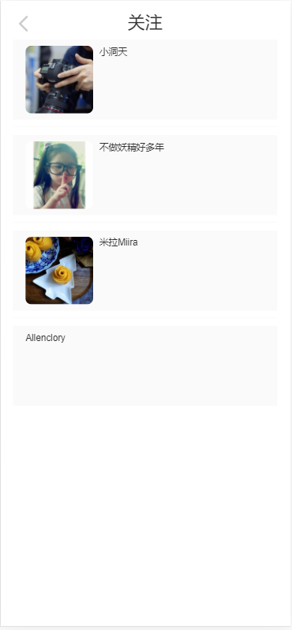
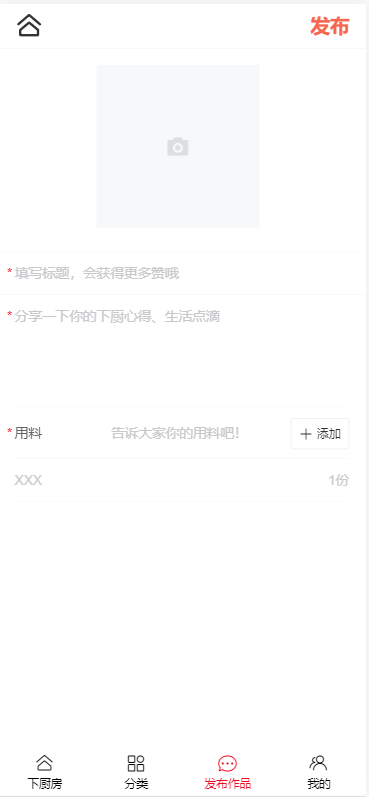
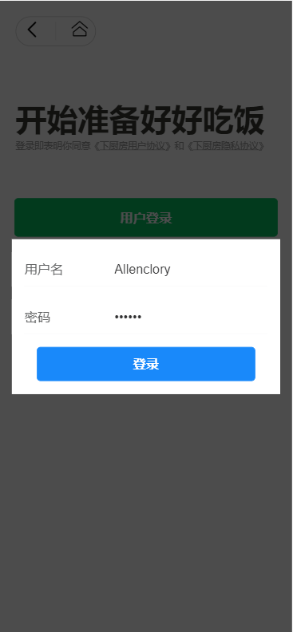

# 项目名称：下厨房

## 演示地址

* 官网：https://www.xiachufang.com/

* 上线网址: http://47.103.204.224:5678

* git仓库地址: https://github.com/the-Suede/Vue-practice-project.git

## 项目截图

> app图片
> 
> 
> 
> 
> 
> 
> 
> 
> 
> 
> 
> 
> 
